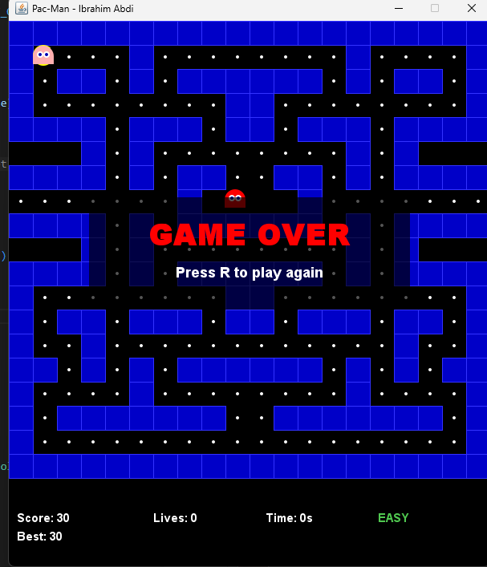

Prompt 1 — MVC Skeleton
I'm building Pac-Man in Java using Swing and the MVC design pattern, split across three files. GameModel.java handles all game logic and data with no Swing imports. GameView.java reads from the model and draws everything the player sees. GameController.java handles keyboard input and runs the game loop using a Swing Timer. For now just create the three class files. 

Prompt 2 — Build the Model
Fill in GameModel.java. The model should track: Pac-Man's position, a grid maze, the dots Pac-Man can eat, the four ghosts and their positions, the player's score, and lives remaining starting at 3, check the wall collisions so that Pac-Man can't move through walls and make sure it stays on the black line and never goes on the blue, eat dots when Pac-Man moves over them, move the ghosts, and detect when a ghost touches Pac-Man. No Swing imports.

Prompt 3 — Build the View
Fill the GameView.java and that it should take a reference to the model and draw everything the player sees ---the maze walls, the dots, Pac-Man as a yellow circle with a mouth, the four ghosts each as a different color, the score, and lives remaining. Show a centered game over message when the game ends. The view should only read from the model and never change game state.

Prompt 4 — Wire the Controller
Fill in GameController.java. Add keyboard controls so the player can move Pac-Man with the arrow keys. Add a game loop using a Swing Timer that updates the model each tick and redraws the view. Stop the loop when the game is over.

Prompt 5 — Fixing the "Tiny Maze, Big Pac-Man" Problem
Hey, I ran the code and it's a bit of a mess visually. The maze is super small in the top corner, but Pac-Man is huge and floating way off to the side which. 
Ai suggested that the maze is using small numbers (1,2,3) the window is using pixels and updated the GameView.java to use a TILE_SIZE variable 30 so the maze scales up to fill the screen I said to make sure Pac-Man stays inside the lines of that maze and the window size matches the maze size.

Prompt 6 — Making Movement Feel "Real"
As the game layout becomes beteer but right now, Pac-Man only moves one 'hop' when I press a key, and it feels really clunky. In the real game, he keeps moving until he hits a wall. Can you update GameModel.java so that once I press a direction, he keeps going that way every time the timer ticks? Also, please fix it so he doesn't just teleport I want him to move like a game charcter so from one spot to the next smoothly.

Prompt 7 — Adding the Ghosts and HUD
I want to get the ghosts moving now. Can you add logic to GameModel.java so the four ghosts move around on their own? They don't need to be smart yet—maybe they just pick a random direction when they hit a wall. Also, my Score and Lives text are kind of hard to see or overlapping the maze. Can you move the text to the very bottom of the screen so it's out of the way and just make it visually more apealing"

Prompt 8 — Expanding the Maze and Fixing "Off-Track" Movement

Error Observed--The maze is too small (only one lane) and it’s possible to actully move off the tracks because the collision checking is a bit loose and too wonky. Can you update the maze array or size which one is mor ecorrect in GameModel.java to be a relative wide grid  -20x20- that looks more like the real Pac-Man level with intersections and boxes? Also, make the movement logic so Pac-Man stays perfectly centered in the lanes. He shouldn't be able to turn unless he is exactly at an intersection, which should stop him from clipping into walls.

Prompt 9 — Mouth Direction and More Enemies
Error Observed: Pac-Man is always facing right, even when moving left or up. Also, the ghosts are overlapping and moving off the grid. So Can you update GameView.java so Pac-Man’s mouth faces the direction he is actually moving? Also, let's add 4 ghosts total. Make sure each ghost starts in the center of the maze and has logic to stay inside the hallways just like Pac-Man, so they don't go flying off into the blue walls or area to be sure make sure to look at any things/logic that would break and try to fix that.

image + problem Observed: I had a problem where when the game starts the enemies teleport to the player(pac man) which instantly ends the round I prompted the AI to make sure they start in their realtive postion aka spwan point and move accordingly and no logic should be broken.

Prompt 10 — Pause, Reset, and High Score
Feature Request- Adding game controls and a way to track the best score. Aswell I need a way to stop the game. Can you add a 'Pause' feature using the P key and a 'Reset' feature using the R key? Update the GameController to listen for these. Also, add a highScore variable to GameModel.java. Every time the game ends, if the current score is higher than the high score, save it and display it at the bottom next to the current score."

Error Observed:I found a bug where the timer keeps counting up even when the game is paused. When I press P to pause the game, everything freezes but the timer keeps going, so my finish time ends up being longer than it should be. Can you fix it so the timer completely freezes the moment I pause, and only continues counting from where it left off when I unpause

Error Observed: My game has two bugs I can't figure out. First, Pac-Man keeps glitching straight through the blue walls . he should only ever move on the black paths. Second, the ghosts randomly freeze and stop moving completely. Can you fix GameModel.java so that wall collision actually checks the correct next tile in the grid, and rewrite the ghost AI so it always finds a valid open direction at every intersection so it can never get stuck? The ghosts should should actively chase me if I get into a certain reltive radius."

Prompt 12 — Ghost Speed & Visual Upgrade 
Two things. First, the ghosts are moving too fast and I can't dodge them so can you slow them down slightly in GameModel.java so they move at about half of Pac-Man's speed? They should still feel like a threat but give me a chance to react. Second, the ghosts look like plain colored circles which is boring. Can you update GameView.java to draw them like real Pac-Man ghosts Keep the four different colors tho to make it look unique.

Prompt 13 — through Tunnel 
In the real Pac-Man game, if you walk off the left edge of the map you come out on the right side, and vice versa. Can you add this tunnel effect to GameModel.java? When Pac-Man's position goes past the right edge of the grid, teleport him to the left edge, and the same in reverse. Do the same for the ghosts too so they can also use the tunnel to chase me.

Error Observed: The tunnel wrapping works on the left side because if I walk off the left edge I appear on the right  but the right side doesn't work at all. I just get stuck at the right wall and nothing happens I also observed its not only me but the Ghost as well experince this. Can you fix it so both sides work?

Prompt 14 — Completion Timer & Leaderboard
When I eat every dot and beat the level I want a leaderboard to pop up. Add a timer to GameModel.java that starts when the game starts and stops when the last dot is eaten. Store the top 5 completion times. In GameView.java, when the game is won, show a leaderboard screen in the center of the maze listing those top 5 times in seconds, ranked 1st to 5th. Make it look clean

Prompt 15 , add all three difficulty of easy mid and hard levels and that must function correctly with consistent enemy behavior and adjuste it where the easy mode has slower as well as fewer enimes.
worked perfect

